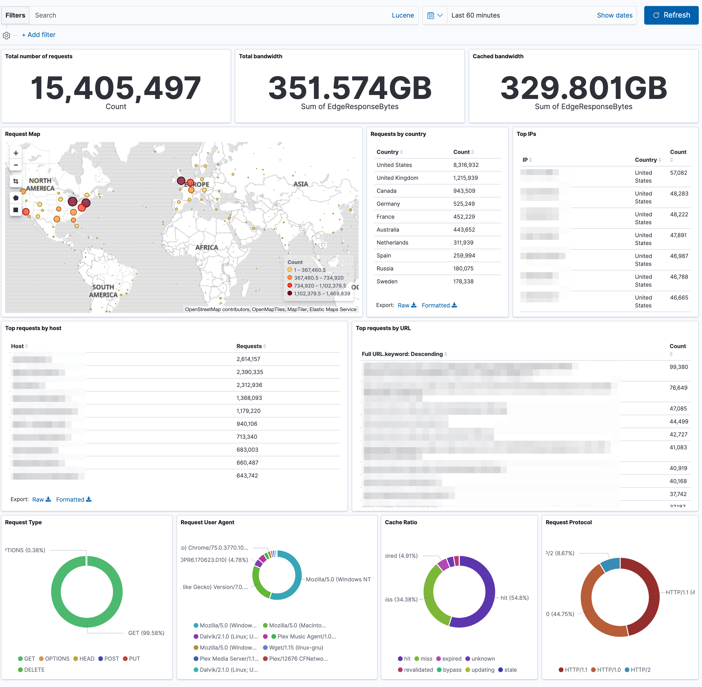

This project allows you to quickly analyze logs from your Cloudflare domains using the ELK stack. 

This project is similar to Cloudflare's [Elasticsearch log integration](https://developers.cloudflare.com/logs/analytics-integrations/elastic/), but is small and easy enough to run on your local machine.



### Prerequisites

1. An enterprise Cloudflare account (required to use the [log API](https://developers.cloudflare.com/logs/logpull-api/requesting-logs/))
2. Your API email address and key (found on your Cloudflare [profile page](https://dash.cloudflare.com/profile))
3. [Docker](https://docs.docker.com/install/) and [Docker Compose](https://docs.docker.com/compose/install/)
4. On Linux, you may need to set `sysctl -w vm.max_map_count=262144` (see [here](https://www.elastic.co/guide/en/elasticsearch/reference/current/vm-max-map-count.html) for more info)


### Quick Start

1. Clone this project

   `git clone https://github.com/cookandy/cloudflare-elk.git`

2. From the `cloudflare-elk` directory, edit `docker-compose.yml` and include the following **required fields**

   - `CF_EMAIL`: your Cloudflare email address
   - `CF_API_KEY`: your Cloudflare API key
   - `CF_ZONES`: a comma-separated list of Cloudflare zone IDs to retrieve logs from (found on your domain's page)
   - `CF_FIELDS`: a comma-separated list of fields to be retrieved for your logs (see all available fields [here](https://developers.cloudflare.com/logs/logpull-api/requesting-logs/))

3. Run `docker-compose up -d` to start the container

4. Wait a minute or two for everything to start up, and then create the geopoint data and import the dashboards by running this command:

   `docker exec cf-elk /scripts/import-dashboard.sh`

5. Go to http://localhost:5601 and view your Cloudflare logs


### Details

This container is built on top of the [sebp/elk](https://github.com/spujadas/elk-docker) project, with some additional start up scripts. The startup script in this project does the following

- Sets system variables
- Updates the cron schedule for fetching logs and cleaning old indices
- Loads cron schedule
- Downloads the [Geolite DB](https://dev.maxmind.com/geoip/geoip2/geolite2/)
- Runs the original [ELK start script](https://github.com/spujadas/elk-docker/blob/master/start.sh)

The container takes a coupe minutes to fully start Elasticsearch, Logstash, and Kibana. After the ELK server has started, you can run `/scripts/import-dashboard.sh` from within the container to set up the [ES geohash](https://www.elastic.co/guide/en/elasticsearch/reference/current/search-aggregations-bucket-geohashgrid-aggregation.html), and import the saved objects. If the import is successful, you'll see

```
{"acknowledged":true}{"success":true,"successCount":16}
```

Because the Cloudflare logging API requires end time to be at least 1 minute in the past, logs will always be delayed by at least 1 minute.

#### Scheduled times

There are two environment variables to control how often scripts are run, and are expressed via [cron syntax](https://crontab.guru)

- `CF_LOGS_FETCH_SCHEDULE`: how often to fetch logs from the Cloudflare API. The default is every `5 min`
- `ES_CLEAN_INDICES_SCHEDULE`: how often run the `clean indices` script. The default is once/day. This clean up script also uses `ES_INDEX_RETENTION_DAYS` to determine how many days worth of indices to keep.

#### Fetching logs

The environment variable `CF_LOGS_FETCH_MIN` determines how many minutes of logs you want to fetch with each call. The default is `5`. The logs are temporarily downloaded as `gz` files inside the container, and are removed once ingested via logstash's [`file_completed_action`](https://www.elastic.co/guide/en/logstash/current/plugins-inputs-file.html#plugins-inputs-file-file_completed_action) option.

#### Volume mappings

The `data` directory contains data from Elasticsearch and logstash, and will be persisted after a container restart. 

- `/data/es-data`: this contains Elasticsearch data
- `/data/logstash-logs`: this contains the logs downloaded from Cloudflare. Logs are put into subdirectories named `<CF_ZONE>/<date>/<time_from>-<time_to>.gz`